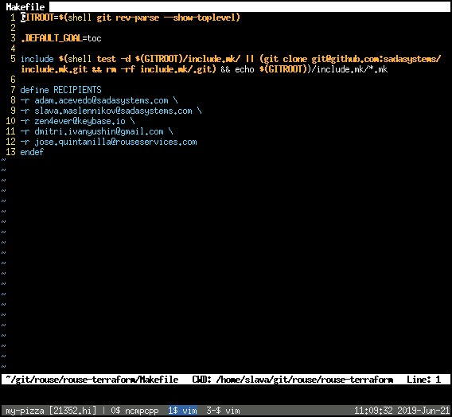
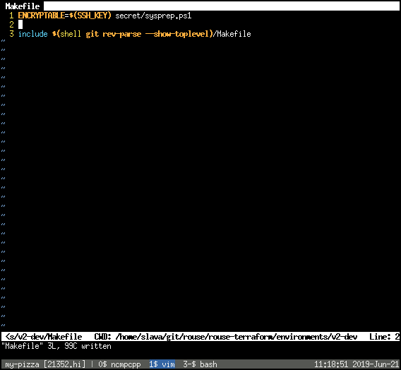
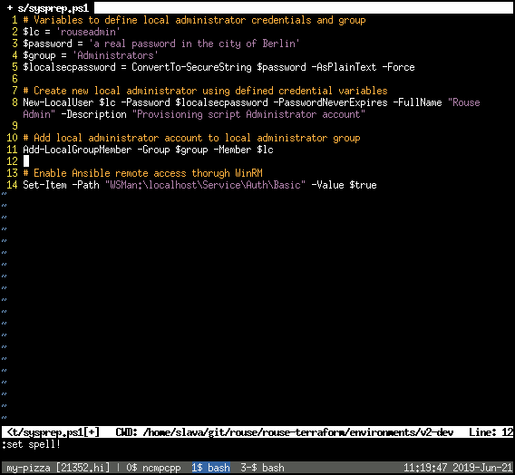
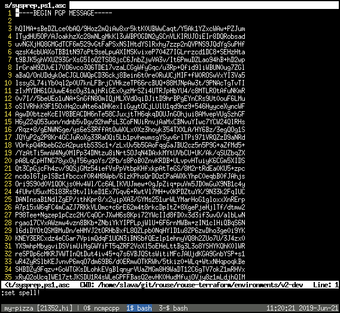

class: center, middle
layout: true
---
# Git, Secrets and You!

### SADA: Google Cloud

### June 21st, 2019

.footnote[Go to presentation [repository](https://github.com/smaslennikov/sada-beer-and-learn-1/)]

---
layout: false
.left-column[
## Agenda
]
.right-column[
 - Have a drink
]
--
.right-column[
 - State the problem
]
--
.right-column[
 - Solve it natively
]
--
.right-column[
 - Solve it externally
]
--
.right-column[
 - Solve by abolishment
]
---
.left-column[
 ## Agenda
 ## Problem statement
]
.right-column[
### Problem
- Secrets in VCS
]
--
.right-column[
### Non-solutions
- Private repositories
]
---
.left-column[
 ## Agenda
 ## Problem statement
 ## Native solution
]
.right-column[
### [Home-made GnuPG wrapper](https://github.com/sadasystems/include.mk#gnupg)
]
--
.right-column[
#### Pros
- Secure
]
--
.right-column[
#### Cons
- Clunky, difficult to on-board
]
--
.right-column[
- Difficult to `git diff` and review
]
---
.left-column[
 ## Agenda
 ## Problem statement
 ## Native solution
 ### GnuPG wrapper process
]
.right-column[
- [Create GnuPG keypair](https://help.github.com/en/articles/generating-a-new-gpg-key)
]
--
.right-column[
- Share public keys
]
--
.right-column[
- Add [Makefile](https://github.com/sadasystems/include.mk/blob/master/Makefile) in your repository
]
--
.right-column[
- Define recipients' emails
]
---
.left-column[
 ## Agenda
 ## Problem statement
 ## Native solution
 ### GnuPG wrapper process
]
.right-column[

]
---
.left-column[
 ## Agenda
 ## Problem statement
 ## Native solution
 ### GnuPG wrapper process
]
.right-column[
- Define path of secret
]
--
.right-column[
- `.gitignore` the secret
]
---
.left-column[
 ## Agenda
 ## Problem statement
 ## Native solution
 ### GnuPG wrapper process
]
.right-column[

]
---
.left-column[
 ## Agenda
 ## Problem statement
 ## Native solution
 ### GnuPG wrapper process
]
.right-column[
#### File tree
```
├── Makefile                    # root Makefile
├── include.mk                  # Makefile includes
├── keys                        # public keys
└── environments
    └── v2-dev
        ├── Makefile            # Makefile per directory with secrets
        └── secret
            ├── .gitignore
            ├── ssh_key
            ├── ssh_key.asc
            ├── sysprep.ps1     # plaintext secrets: gitignored
            └── sysprep.ps1.asc # encrypted secrets
```
]
--
.right-column[
- Run `make encrypt`
]
---
.left-column[
 ## Agenda
 ## Problem statement
 ## Native solution
 ### GnuPG wrapper process
]
.right-column[

]
---
.left-column[
 ## Agenda
 ## Problem statement
 ## Native solution
 ### GnuPG wrapper process
]
.right-column[

]
---
.left-column[
 ## Agenda
 ## Problem statement
 ## Native solution
 ## External solution
]
.right-column[
### [Keybase](https://keybase.io/blog/encrypted-git-for-everyone)
]
--
.right-column[
#### Pros
- Secure
]
--
.right-column[
- Easy to `git diff`
]
--
.right-column[
#### Cons
- No web UI
]
--
.right-column[
- No built-in PR tooling
]
--
.right-column[
- CI must use a Keybase account
]
---
.left-column[
 ## Agenda
 ## Problem statement
 ## Native solution
 ## External solution
 ## Going around the problem
]
.right-column[
### Store secrets outside of git

Example: [`chamber`](https://github.com/segmentio/chamber)
]
--
.right-column[
* uses AWS's SSM & KMS
]
--
.right-column[
* populates environment variables with secrets
]
--
.right-column[
* executes defined command on retrieval
]
---
.left-column[
 ## Agenda
 ## Problem statement
 ## Native solution
 ## External solution
 ## Going around the problem
]
.right-column[
### Usage

```bash
# chamber write $service $key $value
chamber write terraform mysql_root pizzapassword
```
]
--
.right-column[
```bash
# chamber exec $service -- $command
chamber exec terraform -- terraform apply
```
]
--
.right-column[
### Further reading

Slightly more informative [CloudPosse `chamber` docs](https://docs.cloudposse.com/tools/chamber/)
]
---
.left-column[
 ## Agenda
 ## Problem statement
 ## Native solution
 ## External solution
 ## Going around the problem
]
.right-column[
### SADA's GCP port of chamber

- The future is near!
]
